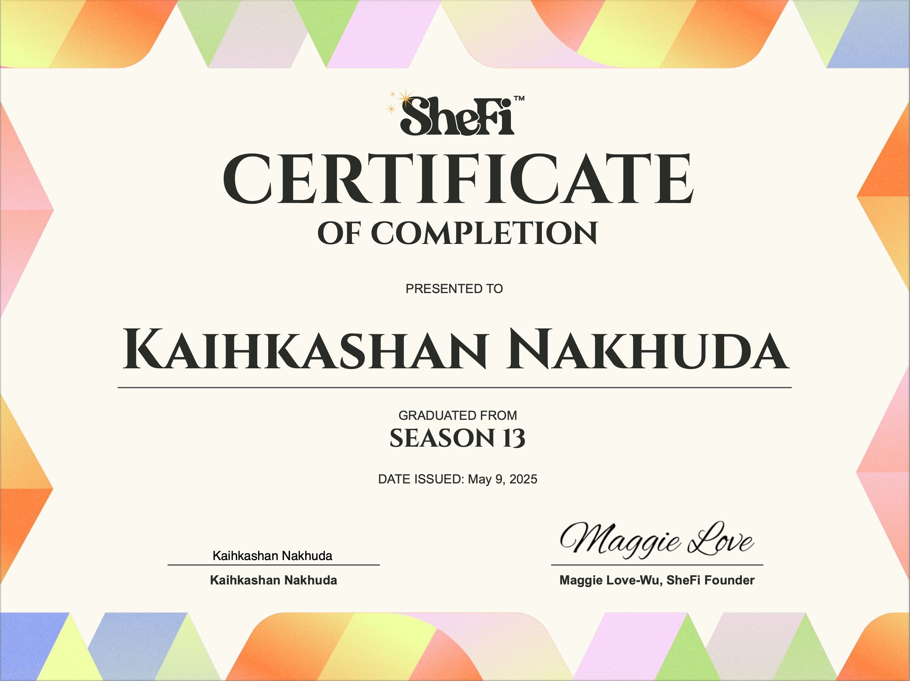

Learnt about Web3 infrastructure, decentralized finance, and consumer crypto as a <a href="https://www.shefi.org/" target="_blank">SheFi</a> scholar. This domain knowledge will help me document blockchain solutions and create technical, user-friendly guides for decentralized apps (dApps).

