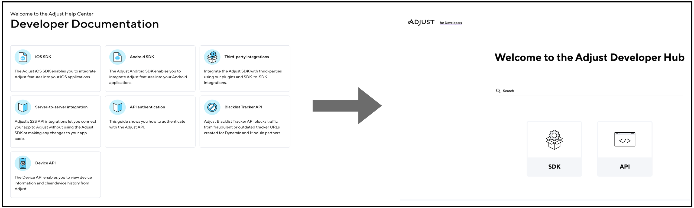

Over the course of my career, I've had to work on documenting new products from scratch as well as making updates to existing documentation. While doing this, I've adopted the following documentation frameworks:
- Diátaxis
- DITA
- Docs as Code

## Diátaxis 

Diátaxis presents  a way of segregating documentation into four different types - tutorials, how-to guides, technical references, and explanation. The framework helps decide what to write, how to write, and how to organize documentation.

Adhering to the Diátaxis framweork strictly is not required - you can make changes as per the needs of the product. Sometimes, writing a tutorial is not possible, so just skip it! Or, if a reference isn't required, you don't have to write one.

#### My work at Adjust

I worked with my colleague to rewrite articles in the Developer Hub using the Diátaxis framework. We were able to structure the information in a way that worked well for our clients. We received good feedback from the Support and Implementations teams. 

References - From [Old content layout](https://dev.adjust.com/en/sdk/android/features/events) | [Archived link](https://archive.ph/hLb28) to [New content layout](https://dev.adjust.com/en/sdk/adobe-extension/android/events) | [Archived link](https://archive.ph/9Kou2)

## DITA

Technical writers use DITA (Darwin Information Typing Architecture), an XML-based architecture to create and manage topic-oriented content. 
DITA maps and topics are XML files, where images, videos, or any other files are inserted as references. DITA is widely adopted in technical documentation for its ability to create reusable content. This ensures consistency, reduces duplicate work, and makes documentation more maintainable.

#### My work at PTC

During my time at PTC, I've used DITA extensively to document multiple flagship products, such as ThingWorx Flow, ThingWorx Analytics Manager, and
ThingWorx Utilities. I've had the opportunity to design the information architecture of ThingWorx Flow and ThingWorx Analytics Manager from scratch.

Concept topic - [Help Center link](https://support.ptc.com/help/thingworx_hc/thingworx_analytics_8/index.html#page/analytics/AnalysisServices_FlexibleScaling.html) | [Archived link](http://archive.today/OcWnW)

Task topic - [Help Center link](https://support.ptc.com/help/thingworx_hc/thingworx_8_hc/en/index.html#page/ThingWorx/Help/Integration_Orchestration/CustomAction85.html) | [Archived link](http://archive.today/mCLKP)

Reference topic - [Help Center link](https://support.ptc.com/help/thingworx_hc/thingworx_8_hc/en/index.html#page/ThingWorx/Help/Integration_Orchestration/InstallingTwxFlowPrerequisitesMSSQL.html) | [Archived link](http://archive.today/wrVI3)

## Docs as Code

Docs as Code is a framework where documentation is treated like code. Writers typically use the same tools and processes that developers use for writing code. This approach involves creating documentation in text files in the Markdown format, and storing them in source code repositories such as Git. It promotes collaboration among developers, writers, and other stakeholders, ensuring that documentation is updated and accurate.

Docs as Code supports version control, automated testing, and continuous integration, ensuring that documentation remains synchronized with code updates and always stays up-to-date. With this approach, product managers or writers can block merging of new features if they don’t include documentation, which encourages developers to treat docunentation as a part of the product.

The Docs as Code framework is used for Developer documentation, which usually includes SDK and API documentation.
 
#### My work at Adjust

I collaborated closely with my team to move the Developer content in the Help Center to its own separate Developer Hub. We brainstormed and finalized the design and structure of the new Developer Hub.

References - [Developer Hub](https://dev.adjust.com/en) | [My GitHub commits](https://github.com/adjust/dev-docs/commits?author=KaihkashanAdjust)