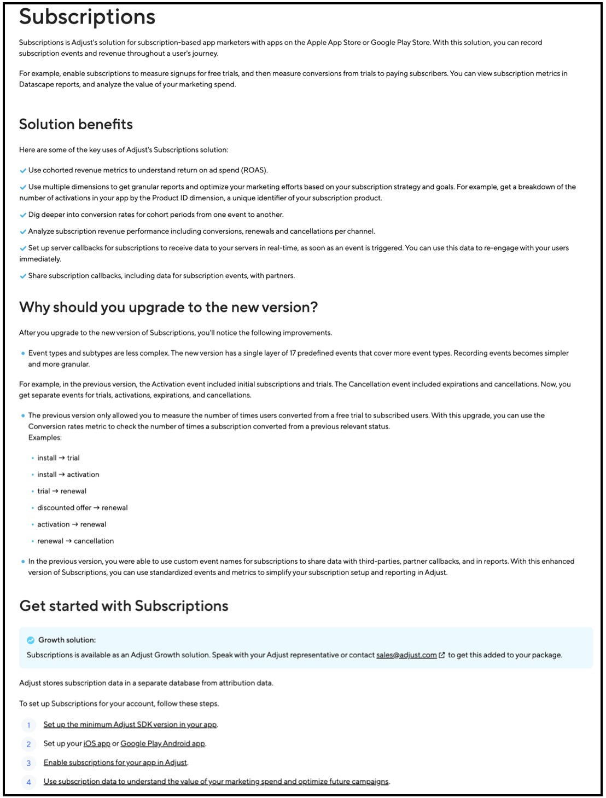
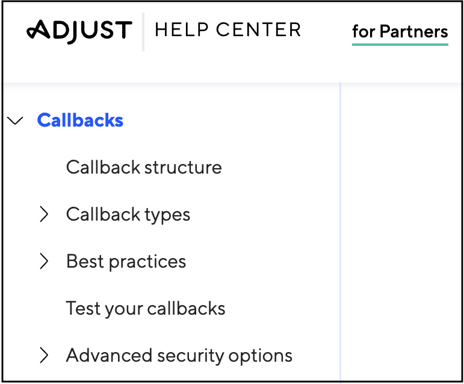
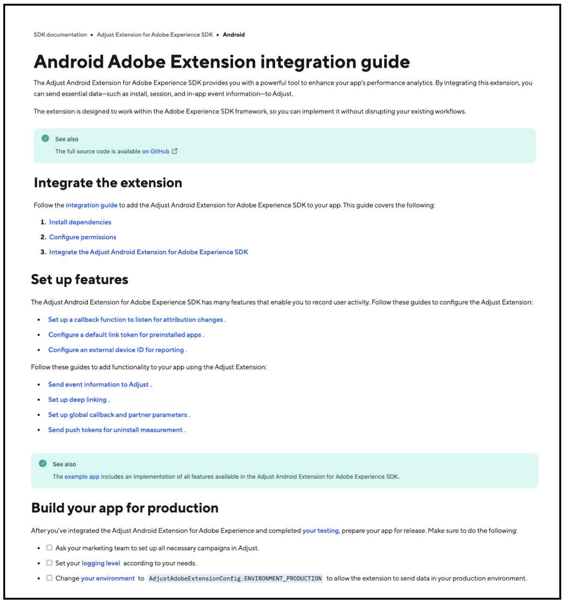

Information architecture and content flow involves structuring and organizing content in a way that makes the information easy to find, understand, and navigate.

### Information architecture: My work at Adjust

I worked extensively on setting up the information architecture of the Adjust Help Center independently, when we moved from the legacy product to the new Adjust product. In addition, I revamped the information architecture of multiple sections within the Adjust Help Center.

For example: I worked on revamping the Meta section, based on bounce off rates from Google Analytics, heatmaps from Hotjar, and feedback from 

:::callout[success]
I revamped the Meta section based on bounce rates from Google Analytics, heatmaps from Hotjar, and feedback from the Implementations team, who worked directly with clients to set up Meta for Adjust. As a result, the percentage of support tickets related to Meta, which previously made up a large portion of total support tickets, decreased by about 60% within the first quarter after publishing this section.
:::

References: <a href="https://help.adjust.com/en/marketer" target="_blank">Adjust Help Center</a> | <a href="https://archive.ph/Hf4oG" target="_blank">Archived link</a>

### Content flow: My work at Adjust

It is also important to pay attention to how information flows within individual articles. You do not want to overwhelm the user too much, but you also do not want to skip any information. Too many images means a lot of scrolling, horizontally or vertically, and skipping images completely would possibly not be beneficial to certain users. Knowing the audience is key to writing content that flows smoothly and is easy to grasp. 

__Subscriptions__

I worked on creating a new section for Adjust's Subscriptions solution. This section was highly appreciated by the Product Manager and Sales teams. Clients were able to independently set up the feature without requiring any assistance from Adjust Technical Account Managers. 

:::callout[success]
Clients appreciated this entire section, and were able to independently set up the feature without requiring any assistance from Adjust Technical Account Managers. This eliminated the need for assistance, freeing up about 80% of the Technical Account Managers' time to focus on other tasks.
:::

References:
- <a href="https://help.adjust.com/en/article/subscriptions" target="_blank">Subscriptions</a> | <a href="https://archive.ph/rUbcV" target="_blank">Archived link</a>
- <a href="https://help.adjust.com/en/article/set-up-subscriptions-for-your-app" target="_blank">Set up subscriptions for your app</a> | <a href="https://archive.ph/ZSNHP" target="_blank">Archived link</a>
- <a href="https://help.adjust.com/en/article/subscription-setup-for-ios-apps" target="_blank">Subscription setup for iOS apps</a> | <a href="https://archive.ph/JDqoI" target="_blank">Archived link</a>
- <a href="https://help.adjust.com/en/article/subscription-setup-for-android-apps" target="_blank">Subscription setup for Android apps</a> | <a href="https://archive.ph/5P2HD" target="_blank">Archived link</a>
- <a href="https://help.adjust.com/en/article/manage-subscription-data" target="_blank">Manage subscription data</a> | <a href="https://archive.ph/PAFow" target="_blank">Archived link</a>

__Partner setup__

Previously, we did not have any dedicated documentation for the Partner audience. I worked on created a completely new set of docs for our 1500+ Technology Partners. 

:::callout[success]
With specific documentation tailored to their use case, over 1500 partners were easily able to set up callbacks to receive data to their servers. This reduced the burden on the Partnerships team. A quarter-over-quarter analysis revealed an 80% decrease in support tickets related to this issue from partners.
:::

References: <a href="https://help.adjust.com/en/article/callbacks-partner" target="_blank">Callbacks for partners</a> | <a href="https://archive.ph/CkhIV" target="_blank">Archived link</a>

__SDK integration guides__

I worked on creating a template for getting started with and setting up the Adjust SDK with a client's app. Content in this single article has links to everything that a developer would need to get set up. 

:::callout[success]
I received great feedback on this from my stakeholders. Clients were able to onboard quickly and were able to connect the Adjust SDK to their app. This reduced the number of calls for the Implementations team by about 80%. 
:::

References: <a href="https://dev.adjust.com/en/sdk/adobe-extension/android" target="_blank">Android Adobe Extension integration guide</a> | <a href="https://archive.ph/1xXuN" target="_blank">Archived link</a>