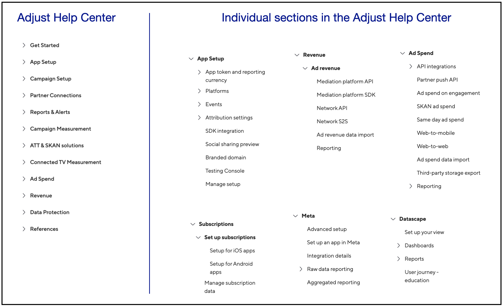

Information architecture and content flow is the discipline of structuring and organizing content in a way that makes the information easy to find, understand, and navigate.

### Information architecture: My work at Adjust

I worked extensively on setting up the information architecture of the Adjust Help Center independently, when we moved from the legacy product to the new Adjust product. In addition, I revamped the information architecture of multiple sections within the Adjust Help Center.

References - [Adjust Help Center](https://help.adjust.com/en/marketer) | [Archived link](https://archive.ph/Hf4oG)

