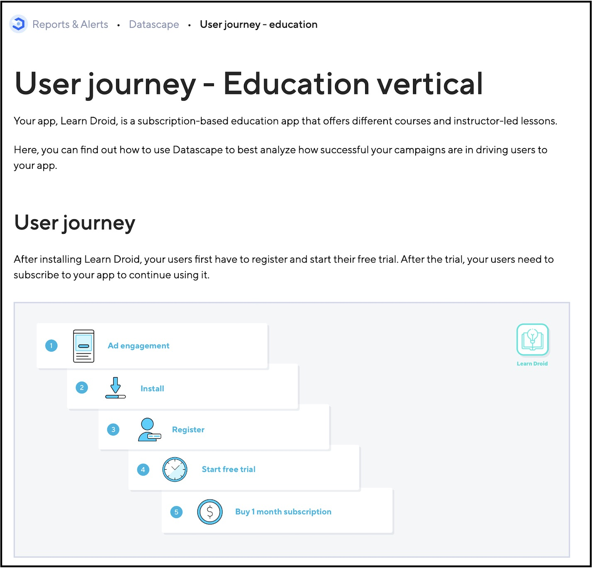

User journey documentation involves mapping the steps that a user needs to take when interacting with a product, from the initial touchpoint to the desired goal. It needs to be an integral part of the documentation strategy irrespective of whether a user needs to only run through a specific feature of the product or access multiple features of a product to accomplish their goal. It aligns perfectly with "tutorials" in the Diátaxis approach to documentation. 

How we document a user journey depends on the audience that we're writing for. We have to know the assumptions we can make and what we can’t. 

Creating user journeys is a great way for multiple stakeholders to collaborate and identify pain points and optimize the flow to make the user experience as seamless as possible. Documenting user journeys well can improve product adoption and onboarding, and reduce and reduce the burden on support teams.

### My work at Adjust

I worked with cross-functional teams to outline the user journey for an Education app, LearnDroid:
1. The steps that a user would follow to subscribe to the app.
2. The steps that a Marketing Manager needs to take to analyze how successful their campaigns are in driving users to the app.

References: <a href="https://help.adjust.com/en/article/user-journey-education-vertical" target="_blank">User journey - Education vertical</a> | <a href="https://archive.ph/sWruf" target="_blank">Archived link</a>